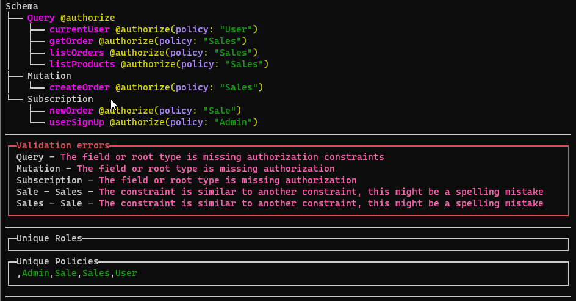

# Vizgql.Console

Vizgql.Console is a command-line interface tool designed for parsing GraphQL SDL documents. It provides an overview of fields and their associated authorization directives, along with listing different roles/policies the directives may have.

## Features

- Parse GraphQL SDL documents from a file or URL.
- Display fields with authorization directives.
- List roles and policies linked to the authorization directives.
- Highlight validation errors and unique constraints in the schema.

## Installation

`dotnet tool install Vizgql.Console --global`

## Usage

To use Vizgql.Console, execute the following commands with the appropriate options:

```
vizgql -f [path_to_file]
vizgql -u [URL]
```

### Options

- `-f, --file`: Path to the file to be parsed.
- `-u, --url`: URL from which text will be downloaded for parsing.
- `-n, --header-name`: HTTP header name for authentication (Default: Authorization).
- `-t, --header-token`: HTTP header token for authentication.
- `-p, --policies`: Comma-separated list of policies to apply to the schema.
- `-r, --roles`: Comma-separated list of roles to apply to the schema.
- `--validations`: Print out any validation errors (Default: false).
- `--unique-constraints`: Prints all the unique constraints as a comma-separated list.
- `--help`: Display help screen.
- `--version`: Display version information.

### Example

```
PS C:\Users\User> vizgql -u https://hotchocolateschema.com/graphql?sdl --validations --unique-constraints
```
